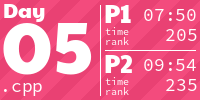
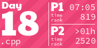

This respository contains my solutions for [Advent of Code 2022](https://adventofcode.com/2022). The beautiful tiles were generated with [this wonderful AoCTiles Script](https://github.com/LiquidFun/adventofcode/tree/main/AoCTiles), for which I am very grateful :)

Unlike [2 years ago](https://github.com/philipplenk/adventofcode20), I was - once more - especially lazy and wrote no additional explanations at all. Aside from some minor cleanup, some performance improvements in once case(day 19) and removal of self-insulting comments produced in the heat of the moment, the code is kept in pretty much its original form, exactly as it was written at 6 am in a severly sleep deprived state. As such it is far from ideal and none of it should be considered a good example for anything ;-)

<!-- AOC TILES BEGIN -->
<h1 align="center">
  2022 - 50 ⭐
</h1>

<!-- AOC TILES END -->
